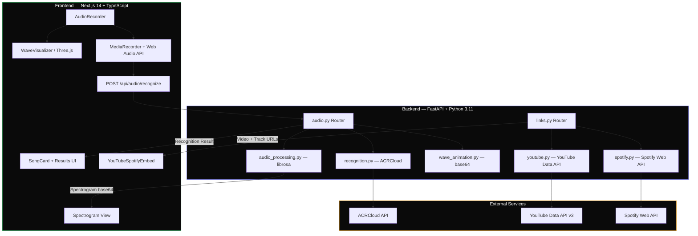
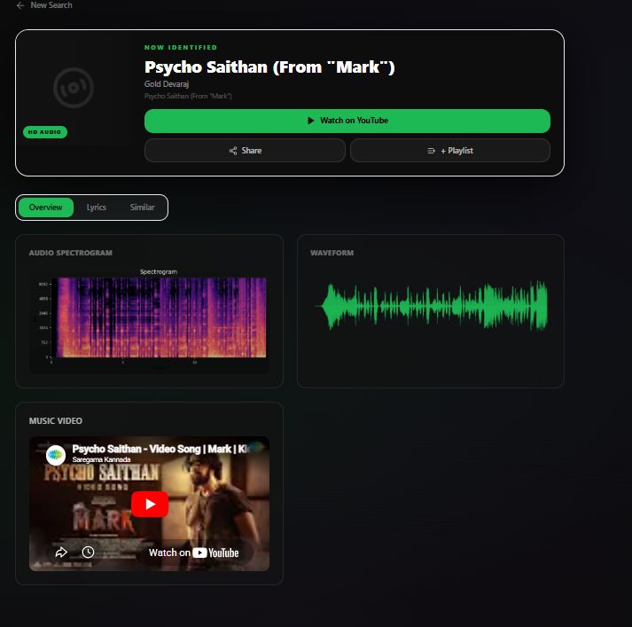

<div align="center">

# 🎧 Song Shazam Pro

### AI-Powered Song Recognition Platform

[](https://python.org)
[](https://fastapi.tiangolo.com)
[](https://nextjs.org)
[](https://typescriptlang.org)
[](https://tailwindcss.com)
[](https://docker.com)
[](LICENSE)

**Record, recognize, and discover music in seconds.** Hum, sing, or play a song — our AI identifies it instantly, surfaces the music video, Spotify link, spectrogram visualization, and similar song recommendations.

[🚀 Live Demo](https://songrecognizer.netlify.app) · [📖 API Docs](https://api.song-shazam-pro.onrender.com/docs) 

---


*Record audio → AI Recognition → Instant Results with YouTube + Spotify links*

</div>

---

## ✨ Features

| Feature | Description |
|---|---|
| 🎙️ **Live Mic Recording** | Record audio directly from your browser with real-time animated waveform |
| 🧠 **AI Song Recognition** | Powered by ACRCloud — identifies songs in seconds from humming, singing, or playback |
| 📊 **Spectrogram Visualization** | Beautiful mel-spectrogram heatmap generated from your audio |
| 🌊 **3D Wave Animation** | Stunning Three.js-powered waveform visualization with framer-motion transitions |
| 🎬 **YouTube Integration** | Instantly find the official music video via YouTube Data API |
| 🎵 **Spotify Integration** | Direct link to play the song on Spotify |
| 🔍 **Similar Songs** | Discover related tracks powered by cosine similarity analysis |
| 📝 **Lyrics Search** | Look up full lyrics for identified songs |
| 🐳 **One-Click Deploy** | Docker Compose for instant local setup |

---

## 🏗️ Architecture


---
Test Images
.png)
.png)


## 🧰 Tech Stack

### Backend
| Technology | Purpose |
|---|---|
| **FastAPI** | High-performance async API framework |
| **Pydantic v2** | Data validation & serialization |
| **librosa** | Audio feature extraction & spectrogram |
| **ACRCloud SDK** | Audio fingerprinting & recognition |
| **Uvicorn** | ASGI server |
| **pytest** | Testing framework |

### Frontend
| Technology | Purpose |
|---|---|
| **Next.js 14** | React framework with App Router |
| **TypeScript** | Type-safe development |
| **Tailwind CSS** | Utility-first styling |

| **Three.js / R3F** | 3D waveform visualization |
| **Recharts** | Data visualization |


### Infrastructure
| Technology | Purpose |
|---|---|
| **Docker** | Containerization |
| **Docker Compose** | Multi-service orchestration |
| **GitHub Actions** | CI/CD pipeline |
| **Render / Vercel** | Production deployment |

---

## 🚀 Quick Start

### Prerequisites
- Python 3.11+
- Node.js 18+
- Docker & Docker Compose (optional)
- ACRCloud account ([sign up free](https://www.acrcloud.com/))
- YouTube Data API key ([get one](https://console.cloud.google.com/))
- Spotify Developer App (optional, [create one](https://developer.spotify.com/dashboard))

### Option 1: Docker (Recommended)

```bash
# Clone the repository
git clone https://github.com/yourusername/song-shazam-pro.git
cd song-shazam-pro

# Copy env file and add your credentials
cp backend/.env.example backend/.env

# Launch everything
docker-compose up --build
```

Open [http://localhost:3000](http://localhost:3000) — backend API docs at [http://localhost:8000/docs](http://localhost:8000/docs).

### Option 2: Manual Setup

#### Backend
```bash
cd backend
python -m venv venv
venv\Scripts\activate        # Windows
# source venv/bin/activate   # macOS/Linux

pip install -r requirements.txt

# Configure environment
cp .env.example .env
# Edit .env with your ACRCloud, YouTube, Spotify keys

uvicorn app.main:app --reload --port 8000
```

#### Frontend
```bash
cd frontend
npm install
npm run dev
```

---

## 🔑 Environment Variables

Create `backend/.env` from `backend/.env.example`:

```env
# ACRCloud (Required)
ACR_HOST=identify-eu-west-1.acrcloud.com
ACR_KEY=your_acr_access_key
ACR_SECRET=your_acr_access_secret

# YouTube Data API (Required)
YOUTUBE_API_KEY=your_youtube_api_key

# Spotify Web API (Optional)
SPOTIFY_CLIENT_ID=your_spotify_client_id
SPOTIFY_CLIENT_SECRET=your_spotify_client_secret

# App
CORS_ORIGINS=http://localhost:3000
```

---

## 📡 API Endpoints

| Method | Endpoint | Description |
|---|---|---|
| `POST` | `/api/audio/recognize` | Upload audio file → identify song |
| `POST` | `/api/audio/spectrogram` | Upload audio → get base64 spectrogram |
| `POST` | `/api/audio/waveform` | Upload audio → get base64 waveform |
| `GET` | `/api/links/youtube?song=...&artist=...` | Get YouTube video link |
| `GET` | `/api/links/spotify?song=...&artist=...` | Get Spotify track link |
| `GET` | `/api/audio/similar?song=...&artist=...` | Get similar song recommendations |
| `GET` | `/health` | Health check |

Full interactive API docs: [http://localhost:8000/docs](http://localhost:8000/docs)

---

## 📂 Project Structure

```
song-shazam-pro/
├── backend/                          # FastAPI + Python audio processing
│   ├── app/
│   │   ├── __init__.py
│   │   ├── main.py                   # FastAPI entry — all endpoints
│   │   ├── routers/
│   │   │   ├── audio.py              # Audio recognition & processing routes
│   │   │   └── links.py              # YouTube & Spotify link routes
│   │   └── models.py                 # Pydantic v2 schemas
│   ├── services/
│   │   ├── recognition.py            # ACRCloud song identification
│   │   ├── youtube.py                # YouTube Data API search
│   │   └── spotify.py                # Spotify Web API integration
│   ├── utils/
│   │   ├── audio_processing.py       # librosa spectrogram generation
│   │   └── wave_animation.py         # Base64 waveform & spectrogram
│   ├── tests/
│   │   ├── test_recognition.py       # Service unit tests
│   │   └── test_endpoints.py         # API integration tests
│   ├── requirements.txt
│   ├── Dockerfile
│   └── .env.example
│
├── frontend/                         # Next.js 14 — App Router
│   ├── app/
│   │   ├── globals.css               # Tailwind + glassmorphism styles
│   │   ├── layout.tsx                # Root layout with providers
│   │   ├── page.tsx                  # Home — Recorder UI
│   │   └── result/page.tsx           # Results display page
│   ├── components/
│   │   ├── AudioRecorder.tsx         # Mic recording with live waveform
│   │   ├── WaveVisualizer.tsx        # Three.js 3D wave animation
│   │   ├── Spectrogram.tsx           # Spectrogram image display
│   │   ├── SongCard.tsx              # Recognized song result card
│   │   └── YouTubeSpotifyEmbed.tsx   # Embedded media players
│   ├── lib/
│   │   └── api.ts                    # Axios API client
│   ├── package.json
│   ├── tailwind.config.ts
│   ├── tsconfig.json
│   ├── next.config.mjs
│   └── Dockerfile
│
├── docker-compose.yml
├── .github/workflows/ci-cd.yml
├── README.md
├── .gitignore
├── LICENSE
└── CONTRIBUTING.md
```

---

## 🧪 Testing

```bash
# Backend tests
cd backend
pytest tests/ -v --tb=short

# Frontend tests
cd frontend
npm run test
```
---

## 📄 License

This project is licensed under the MIT License — see the [LICENSE](LICENSE) file for details.

---

## End Note: 
- If you found that the website is not returning the results which you were expecting : 
- Its Likely the backend might be at sleep (render free tier) 
- Even though it has been set to ping every 10 minutes using GitHub actions
- And the most important factor is, how render.com behaves with free tier users, 
- I even got a mail saying that your service has been taken down since it exceeded the memory limit
- See this warning mail: [warning.png](images/warning.png)
- So for stability, offline works better.
- If you found any issues, happy to hear it from PR
- Thank you.

<div align="center">

**Built with ❤️ by music lovers, for music lovers**

⭐ Star this repo if you found it useful!

</div>
